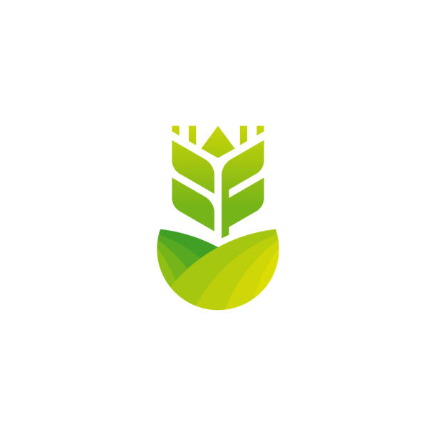

<!-- Improved compatibility of back to top link -->
<a id="readme-top"></a>

<!-- PROJECT LOGO -->
<div align="center">
  
  <h1 align="center" style="color:#4caf50; font-weight: bold;">AgriShield</h1>
  <p align="center" style="font-size:1.2em; color:#555;">
    <em>Blockchain-powered platform for agricultural insurance, carbon credits, lending, and farmer management.</em>
    <br />  
  </p>
</div>

---

<!-- TABLE OF CONTENTS -->
<details open>
  <summary><b>📑 Table of Contents</b></summary>
  <ol>
    <li><a href="#about-the-project">About The Project</a></li>
    <li><a href="#built-with">Built With</a></li>
    <li><a href="#features">Features</a></li>
    <li><a href="#getting-started">Getting Started</a></li>
    <li><a href="#usage">Usage</a></li>
    <li><a href="#roadmap">Roadmap</a></li>
    <li><a href="#license">License</a></li>
  </ol>
</details>

## 🌱 About The Project

> **AgriChain - AgriShield** is a decentralized platform empowering farmers and stakeholders with:

- 🌦️ **Weather-triggered crop insurance**
- 🌳 **Carbon credit management**
- 🧑‍🌾 **Farmer NFT registration**
- 💸 **Lending interface(in progress)**
- 🔒 **Transparent and secure smart contracts**

The platform leverages blockchain (Ethereum/Hardhat), React, and Vite for a seamless user experience and robust backend.

<p align="right">(<a href="#readme-top">back to top</a>)</p>

## 🛠️ Built With
<p align="center">
  
  
  
  
  
  
  
</p>

<p align="right">(<a href="#readme-top">back to top</a>)</p>

## ✨ Features

- 🌦️ Weather-triggered insurance smart contract
- 🌳 Carbon credit tracking and trading
- 🧑‍🌾 Farmer NFT registration and management
- 💸 Lending and borrowing interface(in progress)
- 📊 Dashboard with stats, weather widget, and activity table
- 👛 Wallet connection and profile management

<p align="right">(<a href="#readme-top">back to top</a>)</p>

## 🚀 Getting Started

Follow these steps to run the project locally.

### Prerequisites
- [Node.js](https://nodejs.org/) (v18+ recommended)
- [npm](https://www.npmjs.com/)

### Installation

```sh
# 1. Clone the repository
 git clone <your-repo-url>
 cd AgriShieldnish

# 2. Install Backend dependencies
 cd Backend
 npm install

# 3. Install Frontend dependencies
 cd ../Frontend
 npm install

# 4. Start Hardhat local blockchain
 cd ../Backend
 npx hardhat node

# 5. Deploy contracts (in a new terminal)
 cd Backend
 npx hardhat run scripts/deploymentInsurance.js --network localhost

# 6. Start the Frontend
 cd ../Frontend
 npm run dev

# 7. Open your browser and go to
 http://localhost:5173
```

<p align="right">(<a href="#readme-top">back to top</a>)</p>

## 🧑‍💻 Usage

- Register as a farmer and mint your NFT
- Purchase weather insurance
- Track and trade carbon credits
- Access dashboard for stats and weather
- Use lending interface for loans(in progress)

_For more details, see the documentation in the `Frontend/src` and `Backend/contracts` folders._

<p align="right">(<a href="#readme-top">back to top</a>)</p>

## 🗺️ Roadmap
- [x] Weather insurance smart contract
- [x] Carbon credit module
- [x] Farmer NFT registration
- [x] Mobile responsive UI
- [ ] Lending interface
- [ ] Multi-chain support

<p align="right">(<a href="#readme-top">back to top</a>)</p>

## 📄 License

Distributed under the MIT License. See `LICENSE` for more information.

<p align="right">(<a href="#readme-top">back to top</a>)</p>

